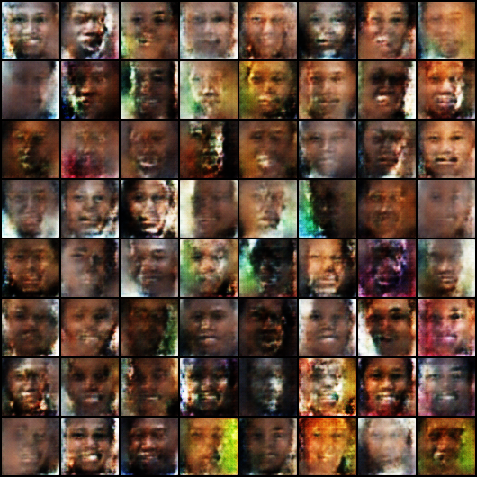

# SynFace
SynFace is a project focused on synthesizing realistic facial images using advanced deep learning techniques.

## Features

- Generate high-quality synthetic face images
- Customizable parameters for face attributes
- Easy-to-use interface for batch generation

## Installation

```bash
git clone https://github.com/yourusername/SynFace.git
cd SynFace
pip install -r requirements.txt
```

## Usage

```bash
python src/train.py
```

## Model
The model used in SynFace is based on a Generative Adversarial Network (GAN) architecture, specifically designed for high-resolution image synthesis.

## Results
Result corresponfing to best epoch (epoch_006) is shown below:
